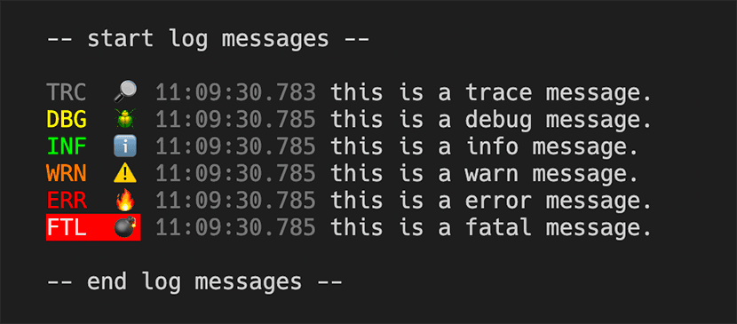

# pino-tiny

a tiny little log formatter for [pino](https://github.com/pinojs/pino).

## 🚀 Enhanced Fork

This is an enhanced version of the original [pino-tiny](https://github.com/holmok/pino-tiny) with the following improvements:

- ✅ **Comprehensive test coverage** with Vitest
- 🕐 **Milliseconds control** with `--hide-ms` flag
- 📊 **Object inspection** with `--show-objects` flag
- 🏷️ **Smart tag filtering** to eliminate redundant log level duplicates

yeah, i know, [pino-colada](https://github.com/lrlna/pino-colada)...

...but is does some weird black box stuff, and i did not like some of the formatting, and i was generally not too happy about certain things, so...

i made pino-tiny!



## using it

pino-tiny is ran like any other pino output mangler, you run it as a process and pipe to it. first you need to install it. it's really not meant to be a production log formatter, so prolly install it in your project as a dev-dependency.

```bash
npm i -D @invntrm/pino-tiny
--or--
yarn add --dev @invntrm/pino-tiny
```

...run it with your application that is already using [pino](https://github.com/pinojs/pino) to log stuff...

```bash
$ node index.js | pino-tiny
```

### CLI Arguments

Now you can tweak the output a bit with command line arguments

```
Options:
      --help            Show help
      --version         Show version number
  -i, --hide-icons      Hide level emoji icons.
  -l, --hide-letters    Hide level letters.
  -t, --hide-timestamp  Hide the timestamp.
      --hide-ms         Hide milliseconds in timestamp.
  -c, --hide-colors     Remove ansi colors from output.
  -w, --hide-web        Hide web stats.
  -o, --show-objects    Show additional object data from logs.
  -m, --msg-key         The key to use for message from the JSON log data.
```

#### 🕐 `--hide-ms` Flag

Controls millisecond display in timestamps for cleaner output:

```bash
# With milliseconds (default)
INF  ℹ️  11:58:59.123  MongoDB Connected

# Without milliseconds (--hide-ms)
INF  ℹ️  11:58:59  MongoDB Connected
```

Perfect for production logs where millisecond precision creates visual noise.

#### 📊 `--show-objects` Flag

Displays additional object data from log entries, automatically filtering out standard pino fields and intelligently handling tags:

```bash
# Standard log entry
INF  ℹ️  11:58:59  User login successful

# With --show-objects (shows additional data)
INF  ℹ️  11:58:59  User login successful {"userId":"123","sessionId":"abc","ip":"192.168.1.1"}
```

**Smart Tag Filtering:**

- Automatically removes tags that duplicate log levels: `trace`, `debug`, `info`, `warn`, `warning`, `error`, `fatal`
- Hides empty tag arrays completely
- Preserves meaningful tags while eliminating redundant information

**Examples:**

```bash
# Input: {"level":30,"msg":"Test","tags":["info","custom","debug"]}
# Output: Test {"tags":["custom"]}  # "info" and "debug" filtered out

# Input: {"level":30,"msg":"Test","tags":["info","debug"]}
# Output: Test  # tags completely hidden as all were duplicates

# Input: {"level":30,"msg":"Test","tags":["production","critical"]}
# Output: Test {"tags":["production","critical"]}  # preserved as meaningful
```

...or put it in your `package.json` file...

```JSON
{
  ...
  "scripts": {
    "dev": "nodemon index.js | pino-tiny --hide-ms --show-objects",
    ...
  }
}
```

## 🧪 Testing

This package includes comprehensive test coverage using [Vitest](https://vitest.dev/):

```bash
# Run tests in watch mode
yarn test

# Run tests once
yarn test:run

# Run linting
yarn lint

# Build the project
yarn build
```

### Test Coverage

The test suite covers:

- ✅ **Log parsing** and JSON handling
- ✅ **Level formatting** with icons and colors
- ✅ **Timestamp formatting** with millisecond control
- ✅ **Web request/response** formatting
- ✅ **Object filtering** and display logic
- ✅ **Smart tag filtering** for level duplicates
- ✅ **Filter functions** and data transformation
- ✅ **CLI argument processing**
- ✅ **Error handling** for malformed input

Run `yarn test:run` to see detailed test results and coverage information.

## use it in code!

pino-tiny can be used in code too as a prettifier, if you want. Here is how you set it up:

```javascript
const { PinoTinyPrettifier } = require("@invntrm/pino-tiny");
const Pino = require("pino");

const logger = new Pino({
  prettifier: PinoTinyPrettifier(/*{[options]}*/),
  prettyPrint: true,
});

logger.trace("trace message");
logger.debug("debug message");
logger.info("info message");
logger.warn("warn message");
logger.error("error message");
logger.fatal("fatal message");
```

### Prettifier Options

The prettifier has the same options as the cli. Plus a filter function.

```typescript
PinoTinyOptions {
  hideIcons?: boolean
  hideLetters?: boolean
  hideTimestamp?: boolean
  hideColors?: boolean
  hideWeb?: boolean
  hideMs?: boolean          // Hide milliseconds in timestamp
  showObjects?: boolean     // Show additional object data
  msgKey?: string
  filter?: (data: any) => any | undefined
}
```

The `filter` option allows you to filter and process the log data. So you can do something like

```javascript
// remove ansi colors and remove messages that have secrets.
const logger = new Pino({
  prettifier: PinoTinyPrettifier({
    hideColor: true,
    hideMs: true, // Hide milliseconds for cleaner output
    showObjects: true, // Show additional data
    filter: (data) => {
      if (data.hasSecret) {
        return { ...data, msg: "*** secret ***" };
      } else {
        return data;
      }
    },
  }),
  prettyPrint: true,
});
```

## extensible-ish

pino-tiny runs like a process you pipe the output of your application into and it makes nice output. it also exports a function `Run` that takes the filter option function as a parameter.

this allows you to control if a log entry gets printed, and you can mangle the output (in the msg property of the log). here is a ridiculous example:

```javascript
const { Run } = require("@invntrm/pino-tiny");

function filter(data) {
  if (data.msg.indexOf("happy") >= 0) {
    // nothing happy gets out.
    return false;
  } else {
    // prepend msg with woah.
    return {
      ...data,
      msg: `[woah!] ${data.msg}`,
    };
  }
}
//start the logger
Run(filter);
```

## what does pino-tiny do?

- shows log level, 3 characters (and not a emoji icon), color coded, and ??? for custom log levels.
- timestamps (no dates). you know what day it is but millisecond timestamps give you some performance output
- strips all but the msg for output
- if there is are `res` and `req` properties in the log data, it will put dimmed request and response info (method, url, status code).
- non-json string data that get piped in (like nodemon) get treated as info logs and outputted.
- does not swallow error messages
- non-pino JSON will be logged as dimmed stringified JSON

### New in v2.0

- programmatic prettifier
- better colors
- handle non-pino json
- emojis! 🔎 🪲 ℹ️ ⚠️ 🔥 💣
- src is now in typescript

### New in v2.1

- added prettifier options
- added prettifier options as cli args
- added back the filter method in options
- added back the extensibility

### New in v2.2

- dep version bumps
- support for `msg` and `message` in logger

### New in v2.3

- added `--hide-ms` flag, to hide milliseconds in timestamp
- added `--show-objects` flag, to show additional object data from logs
- added tests
- migrated to scoped package `@invntrm/pino-tiny`
- improved build process and publishing

### New in v2.4

- **Smart tag filtering**: automatically removes tags that duplicate log levels (`trace`, `debug`, `info`, `warn`, `warning`, `error`, `fatal`)
- **Clean object display**: when using `--show-objects`, tags that only contain log level duplicates are completely hidden
- **Enhanced filtering**: preserves useful tags while eliminating redundant information
- **Better code quality**: improved TypeScript standards compliance and safer object manipulation

#### Tag Filtering Examples

**Before v2.4:**

```bash
INF  ℹ️  11:58:59  💿  remix dev {"tags":["info"]}
```

**After v2.4:**

```bash
INF  ℹ️  11:58:59  💿  remix dev  # tags completely hidden as "info" duplicates level
```

**Mixed tags:**

```bash
# Input: {"tags":["info","custom","debug","important"]}
# Output: {"tags":["custom","important"]}  # level duplicates filtered out
```

This eliminates visual noise from redundant tag information while preserving meaningful metadata.
